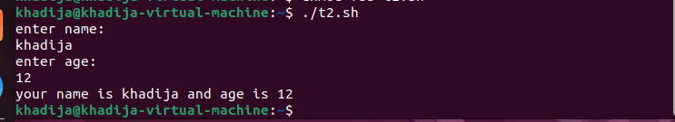
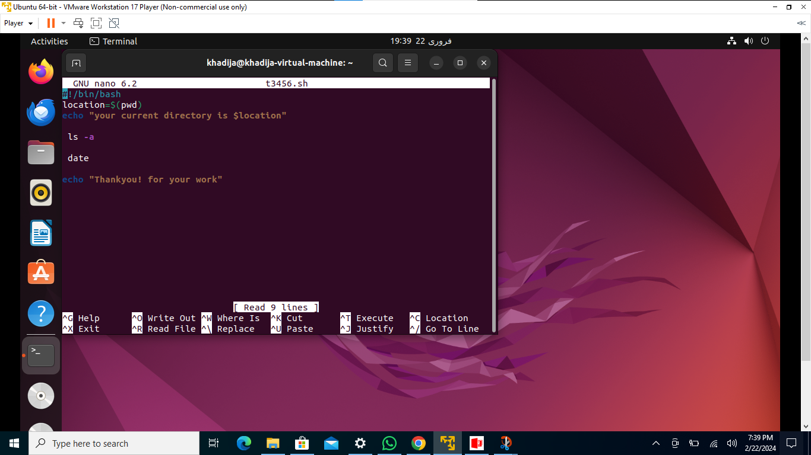
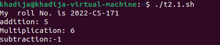

# Khadija Imran 

# 2022-CS-171

# Operating System Lab 6

# Task1:

## You are required to help a new Linux user. Mr. Tom is new Ubuntu user. He wants guidance regarding shell scripting to perform following tasks: 

###### 1. Create a simple script which will take two command line arguments and then multiply them together

###### 2.Create a simple script, which will ask the user for a few pieces of information then combine this into a message which is echo'd to the screen.

###### 3.Now Mr. Tom suddenly lost the track of his current location. Help him find his location.

###### 4.He wants the list of all files present on home directory.

###### 5. Display the current time.

###### 6.He is done with the task and he is happy with your work. He want to display a thankyou message.

# Task 2:

###### 1.Write a simple shell script that uses arithmetic operators (+, -,*) using double parenthesis with printing your own roll # with the results of operations.

###### 2.Write a simple shell script that uses all relational operators with printing your own roll # with the results of operations.

